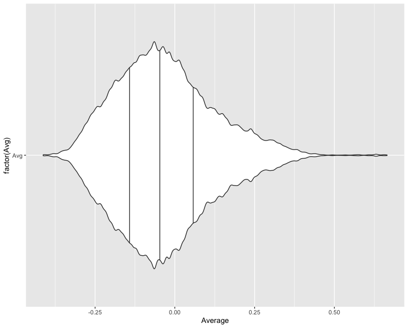
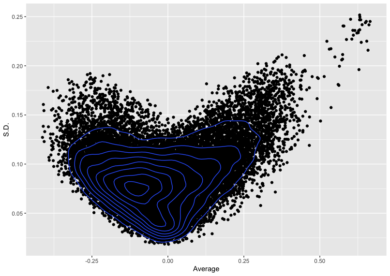

# KliebensteinRotationProject
### Using Arabidopsis Coexpression Networks to Inform New Candidate Genes Involved in Regulation of the Glucosinolate Biosynthetic Pathway

Mariele Lensink, Caroline Keller, Ella Katz, Dan Kliebenstein

## Background
  Glucosinolates (GSLs) are a large group of secondary metabolites found in Arabidopsis and many other Brassica and Cruciferous plants. These compounds are responsible for the spicy sulfur taste of vegetables such as brussel sprouts, horseradish, and mustard. Glucosinolates can be aliphatic, aromatic, or indolic depending on amino acid derivative. Indolic GSLs are derived from Tryptophan, while Aliphatic GSLs are derived from Methionine. The basic structure of glucosinolates includes a Beta-D-Glucose, Sulfated Thiohydroximate, and the Amino Acid-derived R group side chain that varies in C number. The R group has side chain modification that creates variety and diversity of the different glucosinolates made.
  Previous work has been done to build gene coexpression networks using the spearman correlation. This shows us which transcripts are expressing in a similar fashion to our genes of interest. A range of different correlation tables were generated using data from the following papers:

Promoter-Based Integration in Plant Defense Regulation, Baohua et al. 

Understanding the Evolution of Defense Metabolites in Arabidopsis thaliana Using Genome-wide Association Mapping Chan et al.

1,135 Genomes Reveal the Global Pattern of Polymorphism in Arabidopsis thaliana, The 1001 Genomes Consortium

## Project Goal:
•	Look for genetic correlations between traits rather than looking for underlying locus variation.

•	Visually summarize correlations in the 28 gene (gene list of GSL pathway genes derived from baohua et al.) vs whole transcriptome table.

•	Use expression information as phenotype for GWAS.  

## Methods Outline
### Visualizations of Spearman Correlation Tables:
Average spearman correlation value across the 28 gene list was calculated for each gene in the transcriptome (data from spearmancorrelationsedited.xlsx/sheet 1). 
The distribution of these average values were then visually represented using the ggplot2 package in R studio (script of helpful commands: GSLfigs.R).

A subset of 111 genes with average spearman values above 0.4 was chosen based on the distribution of values displayed in these figures. Another subset of genes with moderate average expression correlation (<0.4) but high standard deviation (>0.2) was also pulled from the data, but set aside for analysis at a later date. Gene information on these subsets can be found in spearmancorrelationsedited.xlsx/sheets 3 and 4, respectively.

### Generate Phenotype and Run GWAS
  Subsets of expression tables from the original transcriptome file were created for the 111 high average genes and the original 28 pathway genes (AccessionSubsets_wZscores_chisq.xlsx/sheets 2 and 3) and a zscore for each gene across all accessions was calculated. An average zscore was then calculated and used as a phenotype input for a GWAS: baohuaphenofinal.txt   highavgsubsetphenofinal.txt
  
Results from the GWAS: 111geneGWAS.zip   28geneGWAS.zip 

Regions of interest

### SNP vs Wildtype Frequency in Expressions
  Information tables of SNP variants for genes of interest with hits surpassing the bonferroni correction threshold are included in genesofinterestSNPinfo.xlsx.
One gene in a region of interest at ~22,600,000bp position, AT5G55850, showed prevalence of high impact SNPS. We compared expression profiles between accessions with a SNP of interest for gene AT5G55950 versus accessions with the reference nucleotide using average z score accross the 111 genes of interest gathered from the initial correlation tests. 

### Testing for Possible Epistatic Behavior
The density distibution of the AT5G55850 SNP versus Wild Type violin plot raises a new hypothesis suggesting possible epistasis. We looked down stream on chromosome 5 to the next region of interest to gene AT5G61530. Frequency of allele combinations (SNP vs Wild Type) were than calculated for both genes in every accession. A chi square statistical test was then run on these numbers. Information on accessions and their allele combinations as well as the chi square test can be found in AccessionSubsets_wZscores_chisq.xlsx
